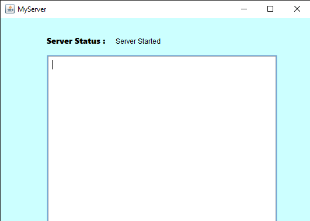
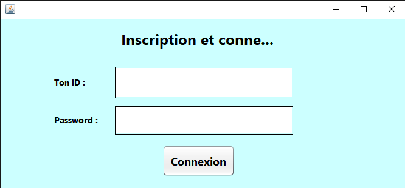
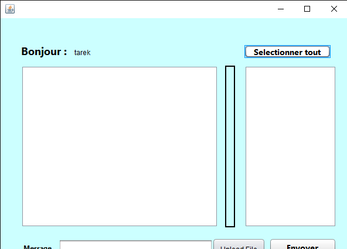

pour executer ce projet:

executer en premier le server class(package: cahtudpserverapplication) pour que le server attende les requetes des clients
l interface graphique du server s affiche:

ensuite executer le ClientRegister(package: chatclientudpapplication) class plusieurs fois pour l authentification des clients

-> entrer votre nom et votre mot de passe et cliquer sur le bouton "connexion" pour s authentifier

apres la reussite de la connection des clients au server, la fenetre ClientRegister se ferme et la fenetre MyClient s'ouvre pour que les clients puissent discuter entre eux

NB: N oublier d ajouter les librairie suivante:
- mysql-connector-java-8.0.27-bin.jar // pour la connection avec la base de donnees